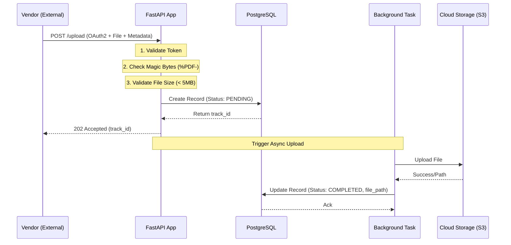

```mermaid
sequenceDiagram
    participant V as Vendor (External)
    participant API as FastAPI App
    participant DB as PostgreSQL
    participant Worker as Background Task
    participant S3 as Cloud Storage (S3)

    V->>API: POST /upload (OAuth2 + File + Metadata)
    Note over API: 1. Validate Token
    Note over API: 2. Check Magic Bytes (%PDF-)
    Note over API: 3. Validate File Size (< 5MB)
    
    API->>DB: Create Record (Status: PENDING)
    DB-->>API: Return track_id
    
    API-->>V: 202 Accepted (track_id)
    
    Note over API, Worker: Trigger Async Upload
    
    Worker->>S3: Upload File
    S3-->>Worker: Success/Path
    
    Worker->>DB: Update Record (Status: COMPLETED, file_path)
    DB-->>Worker: Ack
```
