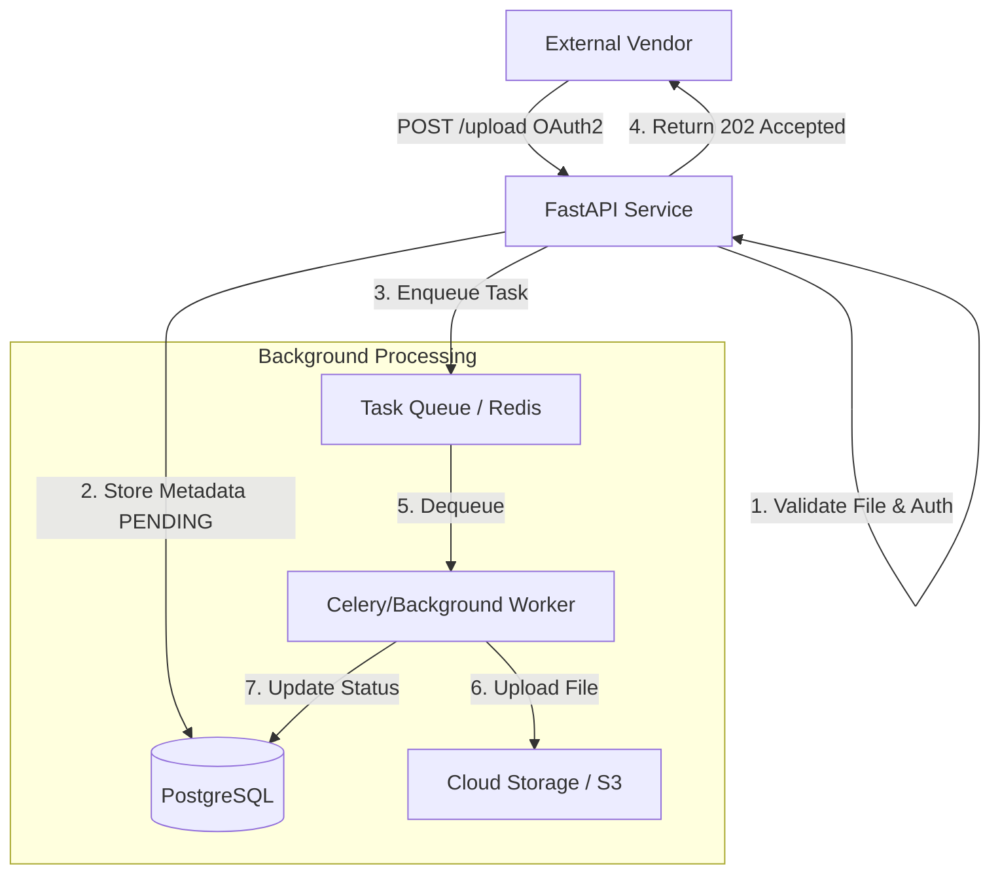

```mermaid
graph TD
    Vendor[External Vendor] -->|POST /upload OAuth2| API[FastAPI Service]
    API -->|1. Validate File & Auth| API
    API -->|2. Store Metadata PENDING| DB[(PostgreSQL)]
    API -->|3. Enqueue Task| Broker[Task Queue / Redis]
    API -->|4. Return 202 Accepted| Vendor
    
    subgraph Background Processing
        Broker -->|5. Dequeue| Worker[Celery/Background Worker]
        Worker -->|6. Upload File| S3[Cloud Storage / S3]
        Worker -->|7. Update Status| DB
    end
```
